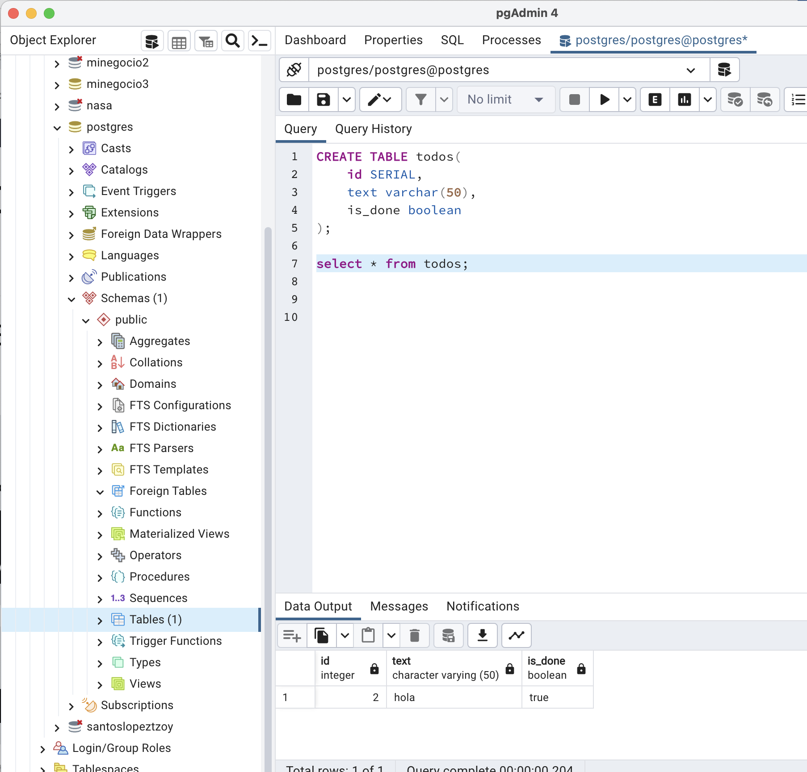

# Crear API usando base de datos Postgres, Docker y FastAPI con Python

## Instalar para que funcione
```
pip install SQLAlchemy
pip install psycopg2
pip install psycopg2-binary
pip install fastapi
```

## Crear la base de datos en Postgres
Se recomienda tener pgAdmin4 y crear la tabla
en la base de datos postgres, en caso que se desee cambiar en que base de datos crearlo, cambiar también donde dice db.py

### Script crear base de datos en Postgres
```
CREATE TABLE todos(
	id SERIAL,
	text varchar(50),
	is_done boolean
);
```
En la imagen se puede observar donde está creado la tabla, la estructura que es igual al script proporcionado y el dato que tiene. 


### Correr el proyecto
```
uvicorn main:app --reload
```

### Creditos
[https://www.youtube.com/watch?v=wcbxMRgu9bE](https://www.youtube.com/watch?v=wcbxMRgu9bE)
